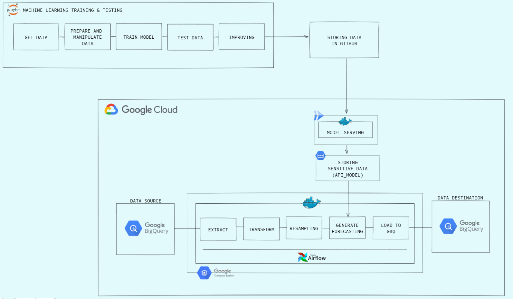
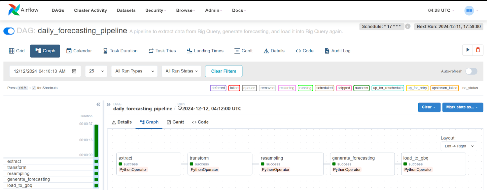

# Time Series Forecasting Pipeline with BigQuery and Apache Airflow

#### **Problem Statements:**
Manual time series forecasting relies on user requests, causing delays in generating updated predictions and making daily decision-making difficult. This approach requires users to manually trigger forecasting. Additionally, relying solely on user requests limits forecasting to on-demand scenarios rather than continuous monitoring.

#### **Goals:**
To address the problem, an automated system is needed to resample and process the previous day's test data, generating new forecasts without manual intervention. By integrating an automatic scheduling tool, the system ensures timely updates every day at 12:00 AM GMT+7, improving accuracy, efficiency, and responsiveness.

#### **Language, Tools, and Depedencies:**
     - Python, SQL 
     - Pandas
     - Numpy
     - Logging
     - Docker, Docker-Compose
     - Apache Airflow
     - Cloud:
          - Google Compute Engine (VM)
          - Google BigQuery
          - Google Secrets Manager
          - Google Cloud Run

#### **Project Structures**
- **`dags/`**: Contains ETL scripts responsible for extracting, transforming, and loading data into Google BigQuery.  
- **`docker-compose.yaml`**: Configures the Airflow container.  
- **`Dockerfile`**: Builds a Docker image containing all necessary dependencies and configurations.
- **`explanations.pdf`**: Contains explanations about machine learning, the data pipeline, and the user interface.
- **`requirements.txt`**: Lists all required dependencies along with their specific versions.


#### **Project Highlights**


This project seamlessly automates the end-to-end data pipeline, transforming raw BigQuery data into actionable forecasts with zero manual effort. Every midnight (GMT+7), the system preprocesses, resamples, and predicts hearing trends using Conv1D, ensuring up-to-date insights. The results are then stored in BigQuery, ready for visualization in the mobile app and continuous monitoring.

#### **Apache Airflow UI**


#### **ETL and Forecasting Process**  

1. **Data Extraction**  
   - The selected raw data is extracted from BigQuery tables.  
   - All data is retrieved and converted into a DataFrame.  

2. **Data Transformation**  
   - Filter extracted data and exclude patients with only one audiometry test.  
   - Ensure that the extracted data exists in the user table.  
   - Drop the ID column.  
   - Reorder the table structure.  
   - Convert the date column to datetime format.  

3. **Data Resampling**  
   - Retrieve the last test per user and compare it with today's date.  
   - If the last test was conducted today, retrieve the two most recent tests for that patient, sort the values based on user ID and date, convert the date to datetime format, and apply the upsampling method to generate daily data.  
   - If the last test was not conducted today, retrieve the two most recent test results and the previous day's forecast for that patient, merge them into one DataFrame, convert the date to datetime format, and apply the upsampling method to generate daily data.  

4. **Forecasting with Conv1D**  
   - Forecasting is generated per user during the process.  
   - Features are extracted from the resampling process, retaining only the necessary features and extracting their values.  
   - The features are formatted as model inputs by selecting the last 30 resampled data points and reshaping them into a 3D tensor (1, 30, 8).  
   - The model API is called, and the input features are fed into it.  
   - After obtaining the forecast results, user IDs are reassigned, and each output is matched with its corresponding features.  
   - Once all patients' forecasts are generated, the output is converted into a DataFrame and sorted by user ID.  

5. **Data Loading**  
   - The forecasted data is mapped with existing data and supplemented with additional information, such as a unique forecast table ID, load timestamp, all forecast results, and calculations for AD and AS.  
   - The final dataset is converted into a DataFrame and stored in BigQuery under the specified table and project ID.

#### [Detail Explanation](https://github.com/Erikszz/data-pipeline-hearity/blob/main/explanation.pdf)

#### **Prepare Google Cloud Platform:**
1. Create a GCP project, example `project_id = 'capstone-project'`.
2. Create a service account in the project, grant it the permissions:
     * BigQuery Admin
     * Secret Manager Secret Accessor 
     * You can include more permissions if you want to expand this project for a future use.
3. Create an access key JSON file and download the private key file.
4. Create VM Instance:
     * Navigate to **Compute Engine > VM instances**.
     * Click **Create Instance**.
     * Under the **"Identity and API access"** section, assign the service account you just created to the VM.
     * Configure other VM settings as required, and click **Create**.

#### **Install Docker**
```
sudo apt-get install docker.io
```

#### [Install Docker-Compose](https://docs.docker.com/engine/install/debian/#install-using-the-repository)

#### **Run Docker Compose and Dockerfile in Detached Mode**
```
sudo docker-compose up -d --build
```

#### **Stop All Containers**
```
sudo docker-compose down
```

#### **Learn More:**
* [Create and start a Compute Engine instance](https://cloud.google.com/compute/docs/instances/create-start-instance)
* [Docker](https://docs.docker.com/)
* [Docker Compose](https://docs.docker.com/compose/)
* [Google BigQuery](https://cloud.google.com/bigquery/docs/)
* [Apache Airflow](https://airflow.apache.org/docs/)